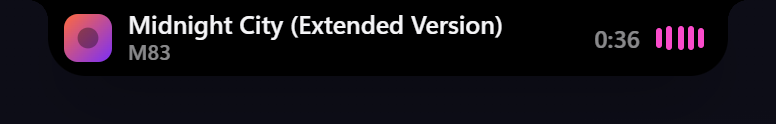
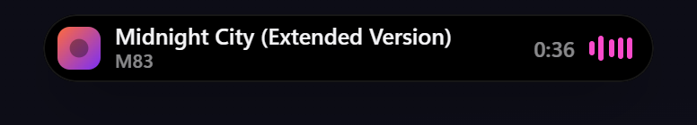
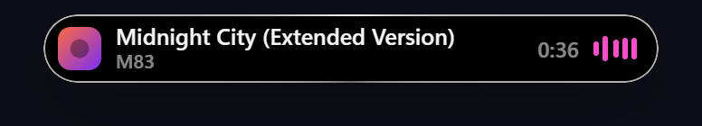
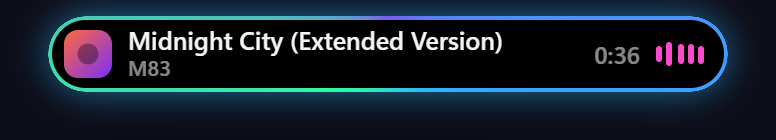
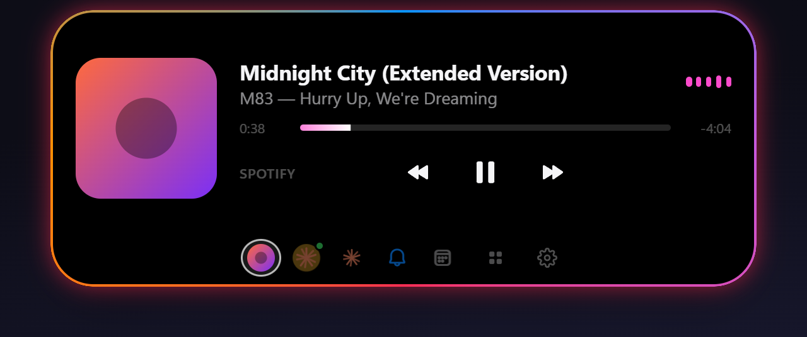
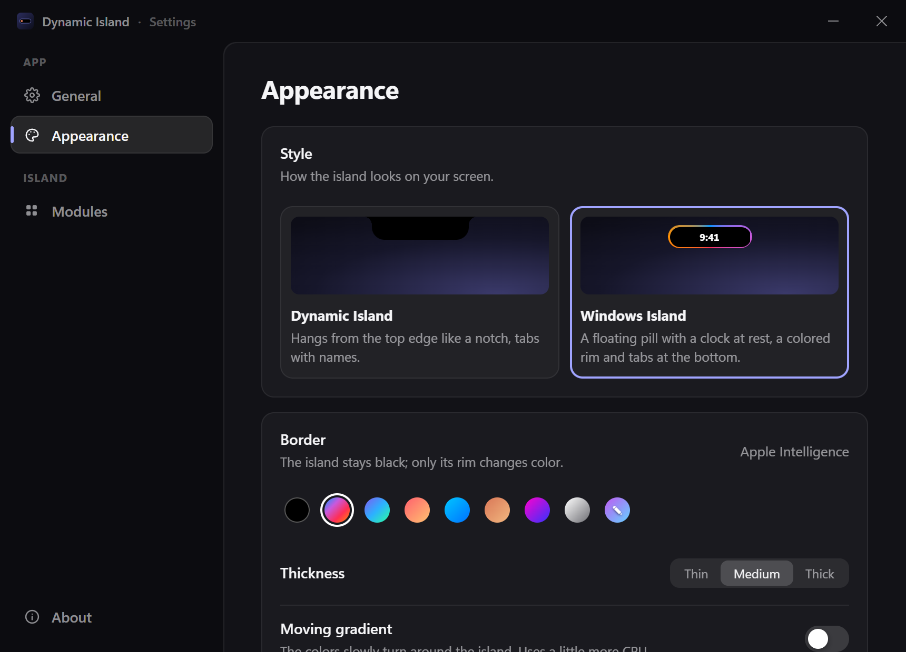
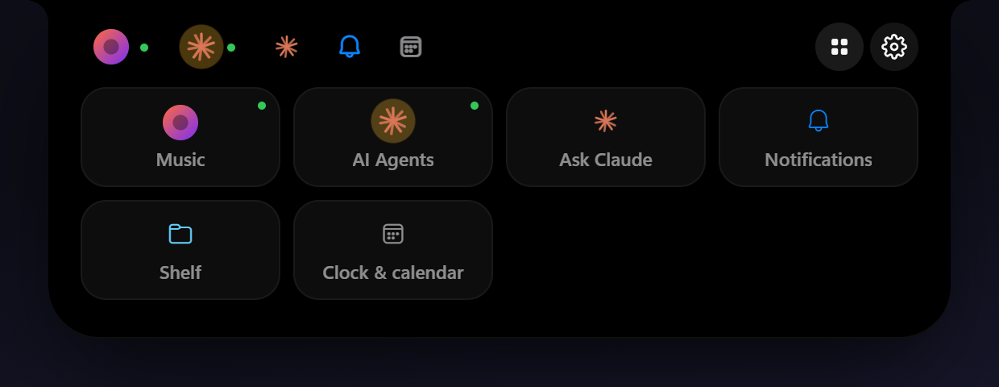
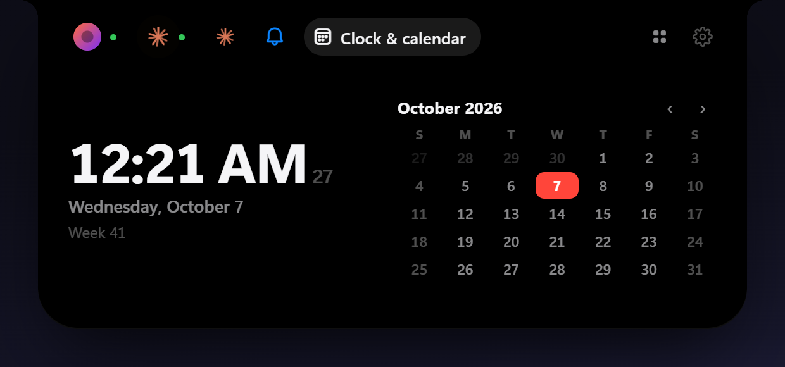
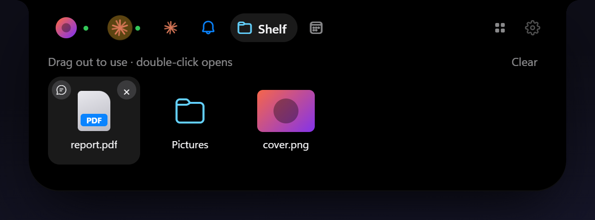

<div align="center">


# Dynamic Island for Windows

An iPhone/macOS-style Dynamic Island for the top of your Windows desktop. It shows what's playing, what your AI coding agents are doing, your notifications and more, and stays out of the way the rest of the time.

[**Download the latest release**](https://github.com/HeyyCzer/windows-dynamic-island/releases/latest)


</div>

## Highlights

- 🤖 **Your Claude Code sessions, live.** Which session is working, which one is waiting for your permission, and how much of your plan you've used, without switching windows.
- 🔍 **Ctrl+F for the whole screen.** **Ctrl+Alt+F** finds any text on your monitors, even inside pictures, highlights every match and takes the mouse to each one.
- 🎵 **Music from any player.** Spotify, browsers, Apple Music: track, artwork, controls and a visualizer. A YouTube video plays muted right in the island, and **Pin** pops it out into a small floating window.
- 💬 **Ask Claude from anywhere.** Press **Ctrl+Alt+Space** and type. It uses your Claude Code login, so no API key is needed, and it can attach a screenshot of the window you were in.
- 🧩 **As many modules as you want, without clutter.** The modules you pin sit in the tab bar and the rest are one click away in the launcher. Drag to reorder them or turn them off.
- 🎨 **Two looks with lots of options.** It can be a plain black notch or a floating pill with a gradient rim. See [Make it yours](#make-it-yours).
- 🪶 **Stays out of the way.** It hides during fullscreen games and videos, expands on hover, and the mouse wheel flips through the tabs. Click the tray icon and it falls into a black hole until you call it back.

<p align="center">
  
</p>

## Make it yours

Not into the colorful look? You don't have to use it. **Settings → Appearance** has two styles:

- **Dynamic Island** (default): a black notch hanging from the top edge, with named tabs. No color unless you want it.
- **Windows Island**: a floating pill that shows the time at rest and has icon tabs at the bottom. Its rim can be a subtle hairline, a single gray, a preset gradient (Apple Intelligence, Aurora, Sunset, Ocean, Claude, Neon, Mono) or two colors of your own. You can pick a thin, medium or thick rim, and turn the moving gradient and the glow on or off.

<table align="center">
  <tr>
    <td align="center"><br /><sub>Dynamic Island</sub></td>
    <td align="center"><br /><sub>Windows Island · classic</sub></td>
  </tr>
  <tr>
    <td align="center"><br /><sub>Windows Island · thin mono</sub></td>
    <td align="center"><br /><sub>Windows Island · Aurora + glow</sub></td>
  </tr>
</table>

<p align="center">
  
  <br />
  
</p>

## Features

**Music**: works with Spotify and anything that shows up in Windows' media controls (browsers, Apple Music, VLC…).

- Current track and artist right in the compact island
- Album art, title, artist and a live progress bar you can click to seek
- Play/pause, previous and next
- Audio visualizer that follows the music
- YouTube in a browser: the video itself plays in the island (muted, in sync with the tab), and **Pin** moves it to a small always-on-top window you can drag anywhere (it snaps to edges, scroll to resize)

<p align="center">
  
  <br />
  
</p>

**AI Agents**: live status of your [Claude Code](https://claude.com/claude-code) sessions.

- What each session is doing right now (editing a file, running a command, waiting for permission…), with a turn timer
- Each session shows its last prompt, so two sessions in the same project are easy to tell apart
- Plan usage limits (5-hour session and weekly) with reset countdowns
- Tokens and responses today, plus a 7-day chart and the last 5 hours from the local transcripts
- Optionally pops open when an agent needs you, finishes (showing how its reply starts) or your limits reset
- **Answer permission requests right in the island**: see the command, file or URL, then Allow, Always allow (the rule Claude Code suggests) or Deny. Answering in the terminal or VS Code keeps working, and the island's request goes away
- Click a session to open its project in VS Code

**Ask Claude**: a conversation with Claude right in the island, using your Claude Code login (no API key).

- **Ctrl+Alt+Space** opens it from anywhere (Ctrl+Shift+Space if another app took it); **Esc** gives the keyboard back
- The answer streams in; if you leave, the island tells you when Claude answered
- 📷 attaches a screenshot of the window you were using; files dropped on it (or sent from the shelf) become attachments
- Runs `claude -p` headless with hooks off, so these chats don't show up as sessions. Read-only tools and web search work; for edits it suggests opening Claude Code

**Find on screen**: like a browser's Ctrl+F, for the whole screen. Press **Ctrl+Alt+F** anywhere (or open it from the launcher) and type.

- Reads everything on every monitor with Windows' own text recognition, so text inside pictures, videos and apps that don't let you search counts too
- Every match is highlighted, the current one in orange; **Enter** takes the mouse to the next one (**Shift+Enter** goes back), ready to click
- Ignores case and accents, and finds phrases across words. **↻** reads the screen again if it changed; **Esc** clears everything
- Runs offline. The screen is read when you start a search and is kept in memory only while the search is open

**Launcher and tabs**: the grid button in the tab bar opens every module as a tile. In **Settings → Modules** you can drag modules to reorder the tabs, choose which ones sit in the tab bar and which stay in the launcher, and turn them on or off. A busy module shows up in the bar even when it isn't pinned, and the island reopens on the last tab you used if you come back within a few minutes.

<p align="center">
  
</p>

**Clock & calendar**: the time, a month calendar (scroll or use the arrows to change months), the week number, and how far away a day is when you click it.

<p align="center">
  
</p>

**Shelf**: drag files or folders onto the island and it keeps them (by reference) until you drag them out to another app. Double-click opens a file, and 💬 asks Claude about it.

<p align="center">
  
</p>

**Clipboard**: what you copy (text, pictures, files) shows up in the island for a moment, and the last 20 items stay in a list.

- Screenshots (Win+Shift+S, Print Screen, ShareX, Greenshot…) open the island with the picture
- Click an item to copy it again; drag pictures and files out to any app; 💬 asks Claude about it; 📁 keeps it on the shelf (pictures are saved to *Pictures\Screenshots*, reusing the file Snipping Tool saved if there is one)
- Text is only kept in memory, and what password managers copy is never read

**Notifications**: WhatsApp, Teams, Outlook, Discord and other apps' notifications, mirrored from Windows. Each new one pops open with the app's icon, and the tab keeps the recent ones (click one to open its app). Windows only lets registered apps read notifications, so **Settings → Modules → Notifications → Enable** registers the island once as a sparse package and restarts it. This needs Windows Developer Mode, since the registration isn't signed.

**GitHub**: open issue counts for the repositories you follow.

- A side bubble next to the island with the total, and a panel with each repo and its newest issue
- Optionally pops open when someone opens a new issue
- Works anonymously for public repos; uses your GitHub CLI login automatically, or a token kept in the Windows Credential Manager for private repos

**System monitor**: CPU, memory, GPU and network with a chart of the last minute, measured like Task Manager does.

- Optional side bubble with the CPU use and a memory dot
- Warns when the CPU or the memory stays maxed out for 30 seconds, naming the app behind it

**Live Activities**: short alerts and ongoing activities:

- Volume level bar, charger plugged in/out and low battery (laptops only), Bluetooth headphones connecting (with their battery) and running low
- Anything a script or app sends through the [local API](#local-api) (downloads, timers, builds…)

**And also**

- Starts with Windows, lives in the tray, checks for updates
- English and Portuguese (Brazil), following your system language by default

<p align="center">
  
</p>

## Install

1. Grab `Dynamic.Island_<version>_x64-setup.exe` from the [latest release](https://github.com/HeyyCzer/windows-dynamic-island/releases/latest).
2. Run it — it installs for your user only, no admin prompt.

Requires Windows 10 or 11 (WebView2 is installed automatically if missing).

### Claude Code integration

Open **Settings → Modules → AI Agents → Claude Code integration → Enable**. This adds HTTP hooks (live status) and a statusline bridge to `~/.claude/settings.json`; a backup is written before every change, and your existing statusline keeps working. Restart Claude Code sessions that were already open. Without it, the island still picks up sessions from Claude Code's transcripts, just with less detail.

The permission hook waits up to 10 minutes for your answer in the island (the other hooks give up after 3 seconds). If the integration was enabled by an older version, the AI Agents panel offers **Update integration**. Answering permission requests in the island can be turned off in the module's settings.

<p align="center">
  
</p>

**Plan limits** come from the statusline when you use the terminal CLI. Since the statusline doesn't run in the IDE extensions, the island also asks Anthropic directly, using the same endpoint as Claude Code's `/usage`. It authenticates with the OAuth token Claude Code keeps in `~/.claude/.credentials.json`, and that token is only ever sent to `api.anthropic.com`. Requests only happen while the panel is open (at most once a minute) or every few minutes while agents are active.

## Local API

The island listens on `http://127.0.0.1:5199` (localhost only; set `DYNAMIC_ISLAND_PORT` to change it). It's the same API as [Windows Island](https://github.com/PedroRuedas/Windows-Island), so its scripts work unchanged.

| Route | What it does |
| --- | --- |
| `POST /notify` | Alert: pops open and goes away after 5 s (default) |
| `POST /activity` | Live activity: stays until removed or until `duration` runs out. Send the same `id` again to update it |
| `DELETE /activity/{id}` | Removes an activity |
| `GET /status` | Current activities and media (never the content of mirrored notifications) |
| `POST /claude/hook` | Raw Claude Code hook payload (answers `204`) |

JSON fields (all optional, but send `title` or `progress`): `id`, `title`, `subtitle`, `icon` (`bell` `chat` `mail` `call` `download` `upload` `timer` `clock` `calendar` `check` `error` `warning` `info` `code` `sync` `heart` `star` `mic` `camera` `location` `wifi` `bluetooth` `music` `volume` `battery` `charging` `headphones` `folder`, or one character), `color` (`#RRGGBB`), `progress` (0–1), `duration` (seconds), `priority` (0–99, default 50), `action` (an `http(s)` link opened on click), `style` (`"level"` for a level bar) and `expand` (default `true` on `/notify`).

```sh
curl -X POST http://127.0.0.1:5199/notify -H "Content-Type: application/json" \
  -d '{"title":"Deploy done","subtitle":"api v2.3 in production","icon":"check","color":"#30D158"}'
```

Clients for [PowerShell](examples/powershell/DynamicIsland.psm1) (with a [demo](examples/powershell/demo.ps1)), [Python](examples/python/island.py) and [Node](examples/node/island.mjs) are in `examples/`.

## Development

You need [Bun](https://bun.sh) and [Rust](https://rustup.rs) (the version is pinned in `src-tauri/rust-toolchain.toml`).

```sh
bun install
bun run app:dev      # the real app, with hot reload
bun run app:build    # installers in src-tauri/target/release/bundle/
```

`bun run dev` serves the UI alone at http://localhost:1420 with fake data (`src/core/mock.ts`), handy for design work in a normal browser. Add `#settings` to the URL for the settings window, or `#pip` for the pinned video.

### Project layout

```
src/
  core/        island state, provider bridge, settings, appearance, i18n
  modules/     one folder per module (music, ai-agents, ask, find, notifications, activities, shelf, clipboard,
               github, monitor, clock), each with its own UI and settings
  locales/     translations (*.json5)
  settings/    settings window
  pip/         pinned YouTube video window
src-tauri/src/
  providers/   OS-side data sources, one per module (media controls, Claude Code, GitHub, local API + volume,
               battery and Bluetooth, Windows notifications, `claude -p` chat, screen text (OCR), shelf, clipboard history,
               performance counters)
  window.rs    click-through overlay window (no caption buttons) + hover hit-testing
  tray.rs      tray menu and black hole
  pip.rs       pinned video window
```

### Adding a language

Copy `src/locales/en.json5` to `src/locales/<code>.json5` (e.g. `es.json5`), translate the values and set `language.name`. That's it — both the UI and the tray pick it up automatically.

### Releasing

```sh
bun run v patch            # bumps package.json, commits and tags vX.Y.Z
git push --follow-tags
```

The tag triggers [the release workflow](.github/workflows/release.yml), which builds the installers and publishes them as a GitHub release.

## Acknowledgements

This project is based on [Vorssaint](https://vorssaint.com).

## License

Copyright © HeyyCzer. Licensed under the [GNU General Public License v3.0](LICENSE) or later.
