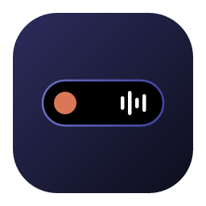
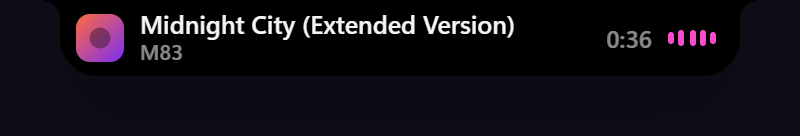
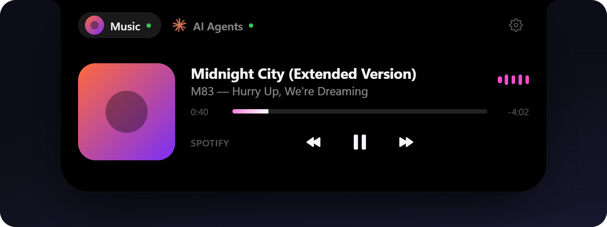
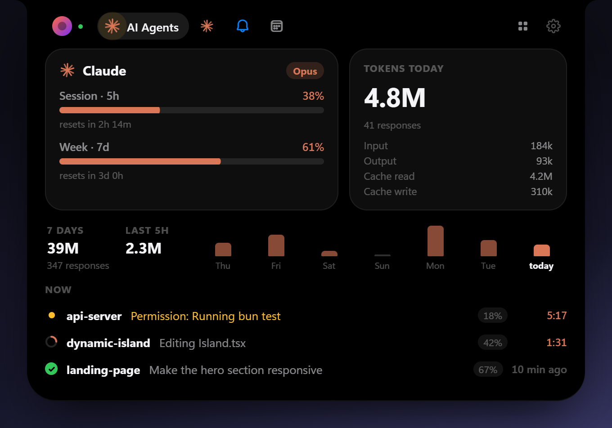
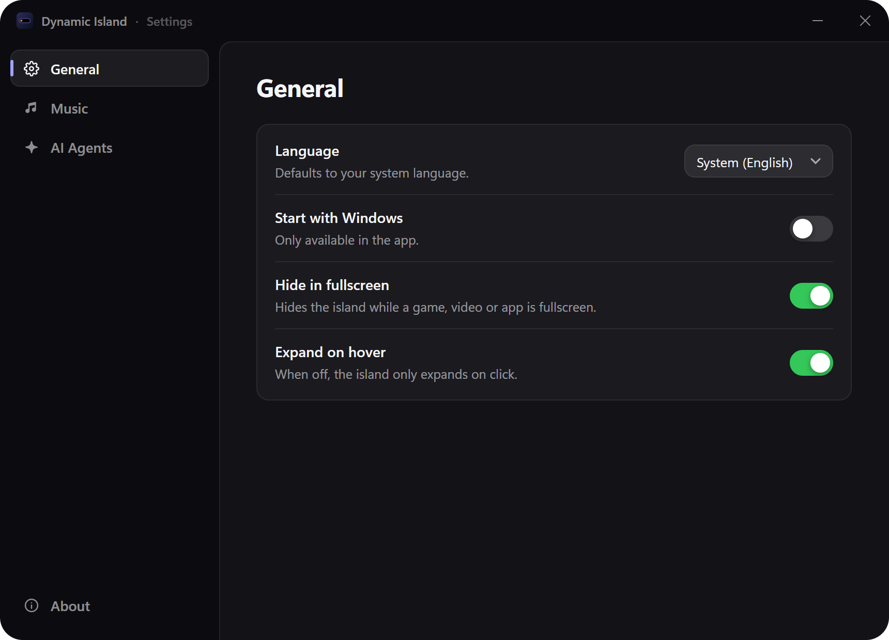
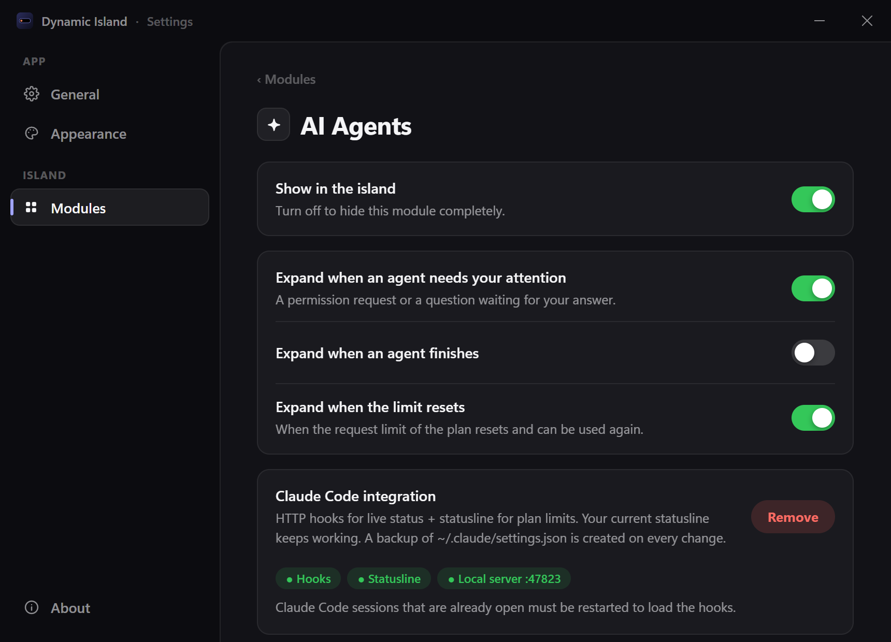

<div align="center">



# Dynamic Island for Windows

An iPhone/MacOS-style Dynamic Island that lives at the top of your Windows desktop — showing what's playing and what your AI coding agents are up to.

[**Download the latest release**](https://github.com/HeyyCzer/windows-dynamic-island/releases/latest)


</div>

## Features

**Music** — works with Spotify and anything that shows up in Windows' media controls (browsers, Apple Music, VLC…).

- Current track and artist right in the compact island
- Album art, title, artist and a live progress bar you can click to seek
- Play/pause, previous and next
- Audio visualizer that follows the music

<p align="center">
  
  <br />
  
</p>

**AI Agents** — live status of your [Claude Code](https://claude.com/claude-code) sessions.

- What each session is doing right now (editing a file, running a command, waiting for permission…) with a turn timer
- Plan usage limits (5-hour session and weekly) with reset countdowns
- Tokens used today
- Optionally pops open when an agent needs your attention or finishes

<p align="center">
  
</p>

**GitHub** — open issue counts for the repositories you follow.

- A side bubble next to the island with the total, and a panel with each repo and its newest issue
- Optionally pops open when someone opens a new issue
- Works anonymously for public repos; uses your GitHub CLI login automatically, or a token kept in the Windows Credential Manager for private repos

**And also**

- Expands on hover (or click), collapses when you leave
- Hides itself while a game, video or app is fullscreen
- Starts with Windows, lives in the tray, checks for updates
- English and Portuguese (Brazil), following your system language by default

<p align="center">
  
</p>

## Install

1. Grab `Dynamic.Island_<version>_x64-setup.exe` from the [latest release](https://github.com/HeyyCzer/windows-dynamic-island/releases/latest).
2. Run it — it installs for your user only, no admin prompt.

Requires Windows 10 or 11 (WebView2 is installed automatically if missing).

### Claude Code integration

Open **Settings → AI Agents → Claude Code integration → Enable**. This adds HTTP hooks (live status) and a statusline bridge to `~/.claude/settings.json`; a backup is written before every change, and your existing statusline keeps working. Restart Claude Code sessions that were already open. Without it, the island still picks up sessions from Claude Code's transcripts, just with less detail.

<p align="center">
  
</p>

**Plan limits** come from the statusline when you use the terminal CLI. Since the statusline doesn't run in the IDE extensions, the island also asks Anthropic directly, using the same endpoint as Claude Code's `/usage`. It authenticates with the OAuth token Claude Code keeps in `~/.claude/.credentials.json`, and that token is only ever sent to `api.anthropic.com`. Requests only happen while the panel is open (at most once a minute) or every few minutes while agents are active.

## Development

You need [Bun](https://bun.sh) and [Rust](https://rustup.rs) (the version is pinned in `src-tauri/rust-toolchain.toml`).

```sh
bun install
bun run app:dev      # the real app, with hot reload
bun run app:build    # installers in src-tauri/target/release/bundle/
```

`bun run dev` serves the UI alone at http://localhost:1420 with fake data (`src/core/mock.ts`), handy for design work in a normal browser. Add `#settings` to the URL for the settings window.

### Project layout

```
src/
  core/        island state, provider bridge, settings, i18n
  modules/     one folder per module (music, ai-agents, github), each with its own UI and settings
  locales/     translations (*.json5)
  settings/    settings window
src-tauri/src/
  providers/   OS-side data sources, one per module (media controls, Claude Code, GitHub)
  window.rs    click-through window + hover hit-testing
  tray.rs      tray menu
```

### Adding a language

Copy `src/locales/en.json5` to `src/locales/<code>.json5` (e.g. `es.json5`), translate the values and set `language.name`. That's it — both the UI and the tray pick it up automatically.

### Releasing

```sh
bun run v patch            # bumps package.json, commits and tags vX.Y.Z
git push --follow-tags
```

The tag triggers [the release workflow](.github/workflows/release.yml), which builds the installers and publishes them as a GitHub release.

## License

Copyright © HeyyCzer. Licensed under the [GNU General Public License v3.0](LICENSE) or later.
